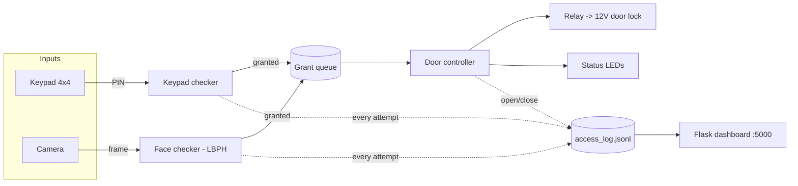

# DoorLockController

    control the door lock without a physical key .


# As a user

    i need open the door without a physical key .

# As an administrator 

    i need to control the door lock and change the password .


# what i learned from this project is

     the power of the code in daily life and how can the machine help .


# Technology Stack:
    
    python 3

    raspbarry pi 3 model B
    
    keybad (Memberane Switch)
    
    3 X Resistor 220
    
    door lock 12v

    USB or Pi Camera (for face recognition)

# this project is part of the CS50 2017 course

# How it works

Two independent workers run at the same time and either one can open the
door:

- **Keypad worker** — reads digits from the 4x4 membrane keypad until `#`,
  and compares the PIN against `checker/keypad/test`.
- **Face worker** — grabs frames from the camera, detects a face (Haar
  cascade), and matches it against a trained OpenCV LBPH model.

Whichever one succeeds pushes a "grant" onto a shared queue; the main loop
pulses the relay to open the door, waits, then re-locks. Every attempt
(granted/denied) and every door open/close is appended to
`data/access_log.jsonl`, which the web dashboard reads.



# Wiring (BOARD/physical pin numbers)

| Component              | Pi physical pin | BCM  | Notes                          |
|-------------------------|:---------------:|:----:|---------------------------------|
| Door relay (IN)         | 36               | 16   | Drives the 12V lock via a relay |
| LED "access granted"    | 40               | 21   | Through a 220Ω resistor         |
| LED "access denied"     | 38               | 20   | Through a 220Ω resistor         |
| Keypad row 1            | 7                | 4    |                                  |
| Keypad row 2            | 11               | 17   |                                  |
| Keypad row 3            | 13               | 27   |                                  |
| Keypad row 4            | 15               | 22   |                                  |
| Keypad column 1         | 12               | 18   |                                  |
| Keypad column 2         | 16               | 23   |                                  |
| Keypad column 3         | 18               | 24   |                                  |
| Keypad column 4         | 32               | 12   |                                  |
| Camera                  | CSI port / USB   | —    | No GPIO pins used                |

> The 12V door lock must **not** be powered directly from a GPIO pin — wire
> it through a relay module (or MOSFET + flyback diode) with its own 12V
> supply; the relay's control input is what pin 36 drives.

The optional RFID reader (`checker/rfid/`) uses SPI (pins 19/21/23/24) and
is a standalone module — it isn't wired into `main.py` yet.

# Setup

```bash
git clone <this repo> && cd Door-lock-raspbarrypi
pip3 install -r requirements.txt
```

Set your keypad PIN by writing it to `checker/keypad/test` (plain text,
digits only).

## Enroll a face (per authorized person)

```bash
python3 -m checker.face.dataset_capture "alice" 30   # opens the camera, captures 30 samples
python3 -m checker.face.train                        # trains checker/face/trainer.yml
```

Repeat `dataset_capture` for each person, then re-run `train` once for all
of them. If no model has been trained, the face worker logs a message and
disables itself — the keypad keeps working on its own.

## Run

```bash
python3 main.py            # the door controller (needs to run on the Pi with GPIO/camera)
python3 webapp/app.py      # dashboard at http://<pi-ip>:5000, reads data/access_log.jsonl
```